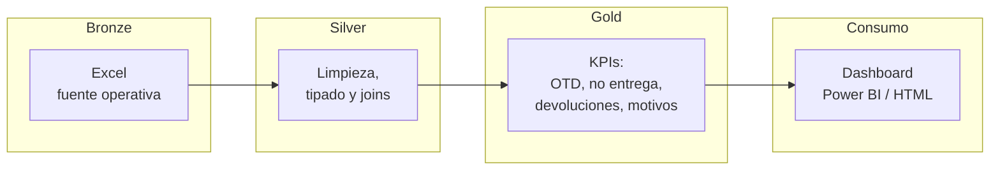

# Análisis de Transporte de Última Milla

[](https://github.com/NJerez-dev/Analisis-Datos-Transporte-UM/actions/workflows/ci.yml)


Pipeline de análisis de operación logística (transporte de última milla) construido con **arquitectura medallón** sobre datos reales de viajes y devoluciones. Refactorizado de notebooks ad-hoc a un paquete Python reproducible con tests, validación de schemas con `pandera` y CI.

> **Estado**: refactor cerrado. Los notebooks originales se conservan en `notebooks/legacy/` como referencia histórica. La lógica viva está en `src/transporte/{bronze,silver,gold,schemas}.py`.

## Problema de negocio

Operador logístico con dependencia operativa de un único cliente retail (>99% de los viajes). El nivel de servicio reportado (OTD = 100% en entregas finalizadas) ocultaba un problema mayor aguas arriba: casi la mitad de los viajes no llegaban a entregarse, y la causa raíz no estaba en el transporte sino en bodega y preparación de pedidos.

El pipeline materializa los KPIs operativos para que ese problema sea visible **antes** del viaje, no después.

## Arquitectura



**Diseño**: tres módulos Python independientes que se ejecutan vía CLI o se orquestan secuencialmente. Bronze lee Excel y persiste como Parquet (todo string + metadata de ingesta); Silver tipifica, normaliza texto y calcula KPIs operativos básicos; Gold agrega y produce las 6 tablas del modelo dimensional para Power BI. Cada capa valida su output con `pandera`.

## Stack técnico

| Capa | Tecnología |
|---|---|
| Lenguaje | Python 3.12 |
| Gestor de entorno | [`uv`](https://docs.astral.sh/uv/) |
| Procesamiento | `pandas`, `pyarrow` |
| Validación de datos | `pandera` |
| Lectura de Excel | `openpyxl` |
| Tests | `pytest` |
| Lint / formato | `ruff` |
| Visualización | Power BI + dashboard HTML |

## Cómo correr

**Pre-requisitos**: [uv](https://docs.astral.sh/uv/) instalado. Python lo provee `uv` automáticamente leyendo `.python-version`.

```bash
git clone https://github.com/NJerez-dev/Analisis-Datos-Transporte-UM.git
cd Analisis-Datos-Transporte-UM
uv sync
```

### Sobre la muestra anonimizada (versionada en el repo)

50 viajes + 25 devoluciones, ideal para verificar el pipeline sin acceso al dataset original:

```bash
uv run python -m transporte.bronze --input data/sample/transporte_um_sample.xlsx --output-dir data/processed
uv run python -m transporte.silver --input-dir data/processed --output-dir data/processed
uv run python -m transporte.gold   --input-dir data/processed --output-dir data/processed --exports-dir data/exports
```

### Sobre datos reales

Coloca el Excel fuente en `data/raw/transporte_um.xlsx` (no se distribuye vía git) y omite el flag `--input`:

```bash
uv run python -m transporte.bronze
uv run python -m transporte.silver
uv run python -m transporte.gold
```

### Atajos con `make` (Linux / macOS / WSL / Git Bash con make)

```bash
make setup    # uv sync
make lint     # ruff
make test     # pytest
make sample   # regenera la muestra anonimizada desde el crudo
make run-all  # bronze -> silver -> gold
```

> **Nota Windows**: `make` no viene preinstalado en Windows + Git Bash. Opciones: instalarlo via Git for Windows extras / scoop / chocolatey, **o** usar los comandos `uv run python -m transporte.X` directos (son la fuente de verdad).

### Tests y cobertura

```bash
uv run pytest --cov=transporte --cov-report=term-missing
```

35 tests, 88% de cobertura. Lo cubierto: lógica de negocio en bronze/silver/gold y todos los schemas. Lo no cubierto: `argparse` y `__main__` handlers.

## Estructura del repositorio

```
.
├── .github/workflows/ci.yml       # CI: ruff + pytest + coverage en cada push/PR
├── src/transporte/
│   ├── __init__.py
│   ├── bronze.py                  # Ingesta Excel → Parquet
│   ├── silver.py                  # Tipos, normalización, KPIs operativos
│   ├── gold.py                    # KPIs agregados + modelo dimensional + CSVs PBI
│   └── schemas.py                 # Contratos pandera por capa
├── notebooks/
│   └── legacy/                    # Notebooks originales pre-refactor (referencia)
├── data/
│   ├── raw/                       # Dataset crudo (gitignored)
│   ├── processed/                 # Outputs intermedios Parquet (gitignored)
│   ├── sample/                    # Muestra anonimizada versionada (50+25 filas)
│   └── exports/                   # CSVs UTF-8 BOM para Power BI (gitignored)
├── scripts/
│   └── build_sample.py            # Regenera la muestra anonimizada desde el crudo
├── tests/                         # 35 tests (bronze, silver, gold, schemas)
├── docs/
│   └── decisiones-diseno.md       # Decisiones técnicas con su porqué
├── dashboard_supply_chain.html    # Dashboard estático
├── Makefile                       # Atajos para Linux/Mac/WSL
├── pyproject.toml                 # Proyecto + deps + ruff/pytest config
└── uv.lock                        # Lockfile reproducible
```

## Principales hallazgos

Sobre 1.013 viajes operativos analizados:

- **47,7% de no entregas** — el OTD del 100% en finalizados oculta un funnel previo roto.
- **27,2% de devoluciones**, mayoritariamente por **errores en tienda** (84%).
- Tres causas principales de no entrega: **producto no cargado (133)**, **sin moradores (115)**, **tiempo excedido (41)**.
- **Concentración de cliente**: 1.011 de 1.013 viajes corresponden a un solo retailer → riesgo estructural.
- **Concentración geográfica**: 986 viajes en Región Metropolitana, 27 en Valparaíso.

**Insight central**: la mayoría de las fallas **no son del transporte** sino de procesos aguas arriba (picking, carga, preparación). Un mejor monitoreo en bodega rinde más que optimizar rutas.

### Recomendaciones operativas
- Validaciones previas al despacho (control de carga vs. orden).
- KPIs de bodega visibles antes del viaje, no después.
- Diversificación de cartera para reducir riesgo de cliente único.
- Reasignación de carga entre vehículos según patrón de no entrega.

## Decisiones de diseño

Las decisiones técnicas con su porqué viven en [`docs/decisiones-diseno.md`](docs/decisiones-diseno.md). Resumen:

- **Arquitectura medallón** con responsabilidades estrictas por capa.
- **Bronze como string + metadata**: cero inferencia de tipos en la capa de ingesta.
- **Parquet** en lugar de SQLite (formato del notebook original).
- **`uv`** en lugar de `pip + venv` o `poetry`.
- **Validación con `pandera`** al final de cada capa, permisiva por diseño (`strict=False`).
- **Muestra anonimizada versionada** con anonimización determinista (SHA1) para CI sin acceso al crudo.
- **`pandas` (no Spark)**: 1.013 filas no justifican Spark; migración natural a `polars` / `DuckDB` si el volumen crece.
- **Logging estructurado** en lugar de `print`.
- **CI con cobertura mínima 80%** (real: 88%).

## Limitaciones conocidas

- **Fuente única** (un cliente, un operador): el modelo no generaliza a multi-cliente sin extender el esquema.
- **Sin ingestión incremental**: cada corrida procesa el dataset completo. Para producción real, agregar marca de tiempo y filtros por particiones.
- **Sin orquestador real** (todavía): los pasos se encadenan vía script. Está planeada la migración a Airflow / Prefect.
- **Sin tests de regresión sobre el dashboard**: cualquier cambio en gold puede romper el dashboard sin alerta.
- **Datos del primer trimestre 2026**: la estacionalidad y eventos comerciales (Cyber, Black Friday) están subrepresentados.

## Roadmap del refactor

- [x] Estructura DE-grade del repo (entorno reproducible con `uv`, layout estándar).
- [x] Muestra anonimizada versionada para tests y CI.
- [x] Extraer lógica de notebooks a módulos en `src/transporte/{bronze,silver,gold}.py`.
- [x] Tests unitarios + smoke test del pipeline completo sobre la muestra (35 tests, 88% cobertura).
- [x] Validación de schemas con `pandera` (contratos por capa).
- [x] CI con GitHub Actions: `ruff` + `pytest` en cada push/PR, badge en README.
- [x] Documento de decisiones de diseño en `docs/`.
- [ ] Migración de outputs intermedios a Parquet **particionado** por año/mes (deferred: dataset actual es de 1 día).
- [ ] Orquestación con Airflow local (Docker) — siguiente bloque del roadmap personal.
- [ ] Ingestión incremental con marca de tiempo — cuando el volumen lo justifique.

## Dashboard


---

Proyecto personal de portafolio. Refactor en marcha como parte del recorrido de Analista de Datos → Data Engineer.
