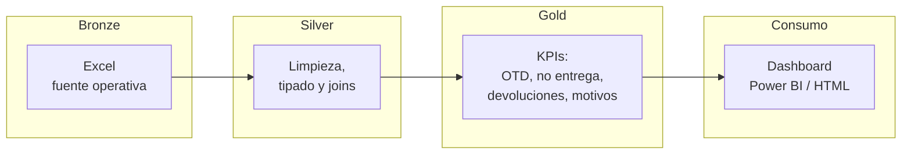

# Análisis de Transporte de Última Milla

Pipeline de análisis de operación logística (transporte de última milla) construido con **arquitectura medallón** sobre datos reales de viajes y devoluciones. El proyecto está siendo **refactorizado a estándar de Data Engineering** desde notebooks ad-hoc a un paquete reproducible con tests, CI y orquestación.

> **Estado**: refactor en curso. Los notebooks originales se conservan en `notebooks/legacy/` como referencia mientras se extrae la lógica a `src/transporte/`. El roadmap del refactor está al final del README.

## Problema de negocio

Operador logístico con dependencia operativa de un único cliente retail (>99% de los viajes). El nivel de servicio reportado (OTD = 100% en entregas finalizadas) ocultaba un problema mayor aguas arriba: casi la mitad de los viajes no llegaban a entregarse, y la causa raíz no estaba en el transporte sino en bodega y preparación de pedidos.

El pipeline materializa los KPIs operativos para que ese problema sea visible **antes** del viaje, no después.

## Arquitectura



**Diseño**: las tres capas son notebooks/módulos independientes que se pueden orquestar con `make run-all` (o por separado). Bronze lee la fuente Excel sin transformar; Silver normaliza tipos, fechas, regiones, y resuelve la relación viajes ↔ devoluciones; Gold agrega y produce los KPIs que consume el dashboard.

## Stack técnico

| Capa | Tecnología |
|---|---|
| Lenguaje | Python 3.12 |
| Gestor de entorno | [`uv`](https://docs.astral.sh/uv/) |
| Procesamiento | `pandas`, `pyarrow` |
| Validación de datos | `pandera` |
| Lectura de Excel | `openpyxl` |
| Tests | `pytest` |
| Lint / formato | `ruff` |
| Visualización | Power BI + dashboard HTML |

## Cómo correr

**Pre-requisitos**: [uv](https://docs.astral.sh/uv/) instalado. Python lo provee `uv` automáticamente.

```bash
git clone https://github.com/NJerez-dev/Analisis-Datos-Transporte-UM.git
cd Analisis-Datos-Transporte-UM
uv sync
```

Para correr sobre la **muestra anonimizada** versionada en el repo (50 viajes + 25 devoluciones, suficiente para verificar el pipeline):

```bash
# Una vez que el refactor exponga los puntos de entrada:
uv run python -m transporte.bronze --input data/sample/transporte_um_sample.xlsx
uv run python -m transporte.silver
uv run python -m transporte.gold
```

Para correr sobre **datos reales**, colocar el dataset crudo en `data/raw/transporte_um.xlsx` (no se distribuye vía git) y apuntar el `--input` a esa ruta. Para regenerar la muestra anonimizada:

```bash
uv run python scripts/build_sample.py
```

## Estructura del repositorio

```
.
├── src/transporte/         # Código del pipeline (bronze, silver, gold) — TBD
├── notebooks/
│   └── legacy/             # Notebooks originales pre-refactor (referencia histórica)
├── data/
│   ├── raw/                # Dataset crudo (gitignored)
│   ├── processed/          # Outputs intermedios Parquet (gitignored)
│   └── sample/             # Muestra anonimizada versionada (50+25 filas)
├── scripts/
│   └── build_sample.py     # Regenera la muestra anonimizada desde el crudo
├── tests/                  # Suite pytest (TBD)
├── docs/                   # Documentación adicional
├── dashboard_supply_chain.html  # Dashboard estático
├── pyproject.toml          # Proyecto + dependencias + ruff/pytest
└── uv.lock                 # Lockfile reproducible
```

## Principales hallazgos

Sobre 1.013 viajes operativos analizados:

- **47,7% de no entregas** — el OTD del 100% en finalizados oculta un funnel previo roto.
- **27,2% de devoluciones**, mayoritariamente por **errores en tienda** (84%).
- Tres causas principales de no entrega: **producto no cargado (133)**, **sin moradores (115)**, **tiempo excedido (41)**.
- **Concentración de cliente**: 1.011 de 1.013 viajes corresponden a un solo retailer → riesgo estructural.
- **Concentración geográfica**: 986 viajes en Región Metropolitana, 27 en Valparaíso.

**Insight central**: la mayoría de las fallas **no son del transporte** sino de procesos aguas arriba (picking, carga, preparación). Un mejor monitoreo en bodega rinde más que optimizar rutas.

### Recomendaciones operativas
- Validaciones previas al despacho (control de carga vs. orden).
- KPIs de bodega visibles antes del viaje, no después.
- Diversificación de cartera para reducir riesgo de cliente único.
- Reasignación de carga entre vehículos según patrón de no entrega.

## Decisiones de diseño

- **Arquitectura medallón** para separar "datos crudos como llegaron" de "datos analíticos confiables". Las tres capas se corren independientes y son auditables.
- **Excel como fuente bronze**: refleja la realidad operativa (la fuente real es así). El pipeline está preparado para cambiar a CSV/Parquet/DB sin tocar silver/gold.
- **Parquet en silver y gold**: columnar, comprimido, tipado. Reduce I/O 10-50x respecto a CSV.
- **`uv` sobre `pip`/`poetry`**: 10-100x más rápido en resolución, lockfile determinista, gestiona Python solo.
- **Muestra anonimizada versionada**: permite que cualquiera ejecute el pipeline y los tests sin acceso al crudo. Anonimización determinista (hash SHA1) preserva relaciones entre hojas.
- **`pandas` vs `polars` / `Spark`**: 1.013 filas no justifican Spark; pandas es suficiente y la curva de aprendizaje del equipo lo favorece. Si el dataset crece a millones de filas, migración natural a `polars` o DuckDB.

## Limitaciones conocidas

- **Fuente única** (un cliente, un operador): el modelo no generaliza a multi-cliente sin extender el esquema.
- **Sin ingestión incremental**: cada corrida procesa el dataset completo. Para producción real, agregar marca de tiempo y filtros por particiones.
- **Sin orquestador real** (todavía): los pasos se encadenan vía script. Está planeada la migración a Airflow / Prefect.
- **Sin tests de regresión sobre el dashboard**: cualquier cambio en gold puede romper el dashboard sin alerta.
- **Datos del primer trimestre 2026**: la estacionalidad y eventos comerciales (Cyber, Black Friday) están subrepresentados.

## Roadmap del refactor

- [x] Estructura DE-grade del repo (entorno reproducible con `uv`, layout estándar).
- [x] Muestra anonimizada versionada para tests y CI.
- [ ] Extraer lógica de notebooks a módulos en `src/transporte/{bronze,silver,gold}.py`.
- [ ] Tests unitarios + smoke test del pipeline completo sobre la muestra.
- [ ] Validación de schemas con `pandera` (contratos por capa).
- [ ] Migración de outputs intermedios a Parquet particionado.
- [ ] CI con GitHub Actions: `ruff` + `pytest` en cada PR.
- [ ] Diagrama de arquitectura técnico extendido en `docs/`.
- [ ] Orquestación con Airflow local (Docker) — bloque siguiente del roadmap personal.

## Dashboard


---

Proyecto personal de portafolio. Refactor en marcha como parte del recorrido de Analista de Datos → Data Engineer.
